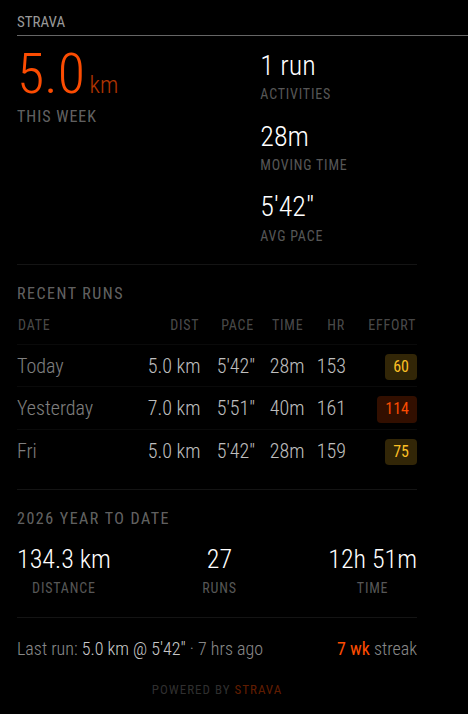

# MMM-Strava

A [MagicMirror²](https://magicmirror.builders/) module that displays your Strava running stats on your smart mirror.



## Features

- **Weekly stats** – distance, run count, moving time, average pace
- **Recent runs** – compact table with distance, pace, duration, heart rate, and relative effort
- **Year to date** – total distance, runs, and time from Strava's built-in stats
- **Run streak** – consecutive weeks with at least one run
- **Training nudges** – alerts when mileage drops or you haven't run in a while
- **Auto-refreshing OAuth** – tokens refresh automatically, no re-authorization needed
- **Stale-safe** – keeps showing last-known data during API hiccups

## Installation

1. Navigate to your MagicMirror modules directory:
   ```bash
   cd ~/MagicMirror/modules
   git clone https://github.com/frankrenehan/MMM-Strava.git
   cd MMM-Strava
   npm install
   ```

2. Create a Strava API application:
   - Go to https://www.strava.com/settings/api
   - **Application Name:** MMM-Strava
   - **Authorization Callback Domain:** localhost
   - Note your **Client ID** and **Client Secret**

3. Run the one-time OAuth setup:
   ```bash
   node setup.js --clientId=YOUR_CLIENT_ID --clientSecret=YOUR_CLIENT_SECRET
   ```
   Open the displayed URL in a browser, authorize the app, and tokens will be saved automatically.

   > **Port 5000 in use?** On macOS, AirPlay uses port 5000. Use `--port=5050` or any free port.

   > **Running headless on a Pi?** Run `setup.js` on your Mac, authorize in the browser, then `scp tokens.json` to the Pi.

4. Add the module to your `config/config.js`:
   ```javascript
   {
       module: "MMM-Strava",
       position: "bottom_left",
       header: "Strava",
       config: {
           clientId: "YOUR_CLIENT_ID",
           clientSecret: "YOUR_CLIENT_SECRET"
       }
   }
   ```

5. Restart MagicMirror.

## Configuration

| Option | Default | Description |
|--------|---------|-------------|
| `clientId` | `""` | Your Strava API Client ID |
| `clientSecret` | `""` | Your Strava API Client Secret |
| `updateInterval` | `900000` | Refresh interval in ms (default: 15 min) |
| `recentActivities` | `3` | Number of recent runs to display |
| `showWeeklyStats` | `true` | Show "This Week" section |
| `showYearToDate` | `true` | Show YTD totals |
| `showRecentRuns` | `true` | Show recent activities table |
| `showSufferScore` | `true` | Show relative effort badges |
| `showHeartRate` | `true` | Show average HR column |
| `showStreak` | `true` | Show weekly run streak |
| `units` | `"metric"` | `"metric"` (km) or `"imperial"` (miles) |
| `maxWidth` | `"400px"` | Maximum module width |
| `animationSpeed` | `1000` | DOM update animation speed in ms |

## API Rate Limits

Strava allows 200 requests per 15 minutes and 2,000 per day. The module uses approximately 2–3 requests per refresh cycle, so at the default 15-minute interval you'll use roughly 192–288 requests per day – well within limits.

## Troubleshooting

**"Missing clientId or clientSecret in config.js"**
Add your Strava API credentials to the module config in `config/config.js`.

**"No tokens found. Run: node setup.js"**
You haven't completed the OAuth setup yet. Run `setup.js` as described above.

**"Token refresh failed. Re-run setup.js"**
Your refresh token has been revoked (e.g., you deauthorized the app on strava.com). Re-run `setup.js` to re-authorize.

**No heart rate or suffer score data**
These require a heart rate source (chest strap, watch, phone sensor) during the activity. Activities without HR data will show "–" in those columns.

## License

MIT – Frank Renehan

## Acknowledgements

- [MagicMirror²](https://magicmirror.builders/) – the open-source smart mirror platform
- [Strava API](https://developers.strava.com/) – activity data
